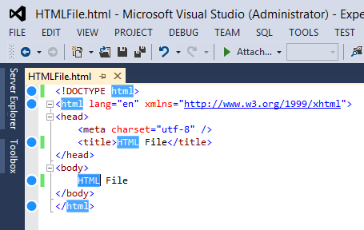
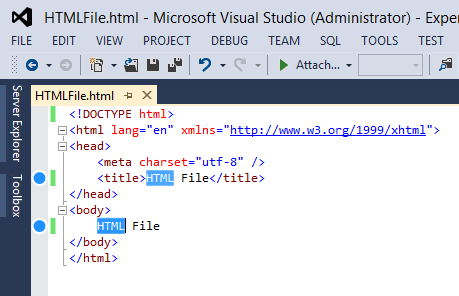
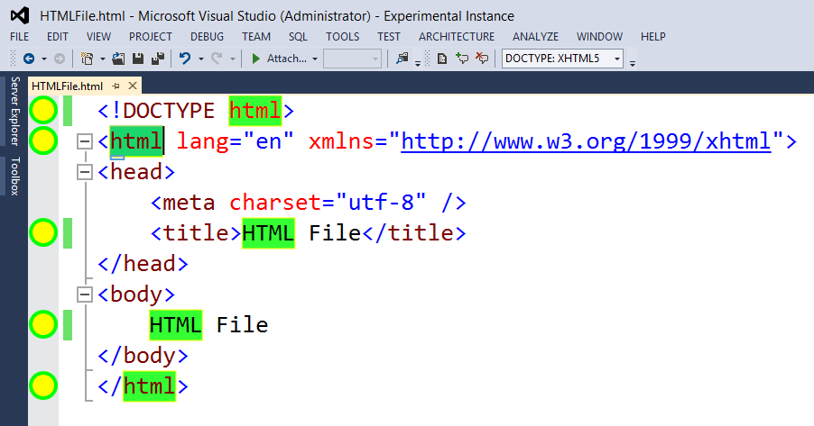
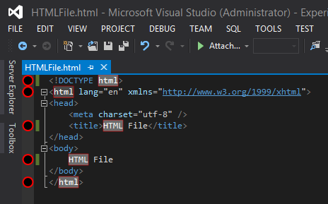
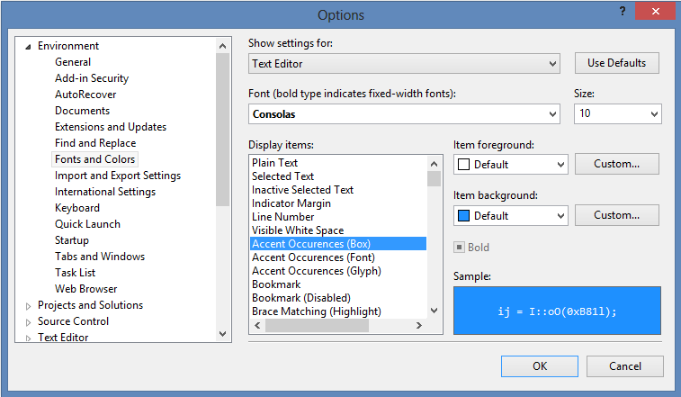

# NO LONGER MAINTAINED

This repository is no longer maintained.  It has been archived but can still be forked.  It is licensed under MIT.

# Accent Occurrences

> The Accent Occurrences extension adds an accent/highlight feature to Visual Studio 2012-2015 that allows you to quickly see all the occurrences of a selected word or selected characters.

#### Features:
- Customizable colors for background, border, font, and glyph
  - TOOLS → Options... → Environment → Fonts and Colors → Accent Occurrences (Box/Font/Glyph)
- Hold the `Ctrl` key while selecting text to make the search **case sensitive**
- Select using the keyboard or mouse

#### Examples and Customization:

Default

Case sensitive holding down the `Ctrl` key

LemonLime, 200%

OnTheDarkSide

TOOLS → Options... → Environment → Fonts and Colors → Accent Occurrences (Box/Font/Glyph)

####Build
[Visual Studio 2012](https://www.microsoft.com/en-us/download/confirmation.aspx?id=30682), [Visual Studio 2012 SDK](https://www.microsoft.com/en-us/download/details.aspx?id=30668), and [Visual Studio 2015](https://www.visualstudio.com/vs-2015-product-editions) are required to build this project. Visual Studio 2012 SDK provides the backwards compatibility to run this extension in older versions of Visual Studio.

#### Contributing
Pull requests for bug fixes or new features are welcome.

#### Version History:
**1.3.0**

- White-space only selections are now ignored.  If you select text that contains both white-space and non-white-space characters the white-space will not be ignored.
  - See [Github](https://github.com/coderfin/AccentOccurrences/issues/3) for more details.

**1.2.2 - 1.2.1**

- Reverted references to an older version allowing the extension to install and run correctly in older versions of Visual Studio.
  - See [Github](https://github.com/coderfin/AccentOccurrences/issues/2) for more details.

**1.2.0**

- Now installable in Visual Studio 2012-2015 (Community, Pro, and Enterprise).
- Created a [GitHub repository](https://github.com/coderfin/AccentOccurrences) for the project.

**1.1.0**

- Now installable in Visual Studio 2013 as well as 2012.

**1.0.1**

- Fixed an `"Object reference not set to an instance of an object."` error that prevented the extension from installing correctly through the Visual Studio Extensions and Updates manager.

**1.0.0**

- Initial Release

##### ACCENT: Verb - to give emphasis or prominence to.

##### Links that were useful in developing this extension

- http://social.msdn.microsoft.com/Forums/en-US/vsx/thread/3e9f0fcf-a03f-4508-9a2a-5b0369377d14
- http://msdn.microsoft.com/en-us/library/dd885121.aspx
- http://msdn.microsoft.com/en-us/library/vstudio/b389wd38.aspx
- http://solutions.devx.com/ms/msdn/extending-visual-studio-2010-to-support-additional-programming-languages.html
- http://msdn.microsoft.com/en-us/library/bb166195.aspx
- http://stackoverflow.com/questions/6641899/how-to-encapsulate-user-setting-options-page-in-visual-studio-2010-addin
- http://msdn.microsoft.com/en-us/library/vstudio/ee361745(v=vs.100).aspx
- http://social.msdn.microsoft.com/Forums/en-US/vsx/thread/19a2c13d-86ac-4713-9897-88cc585201f1/
